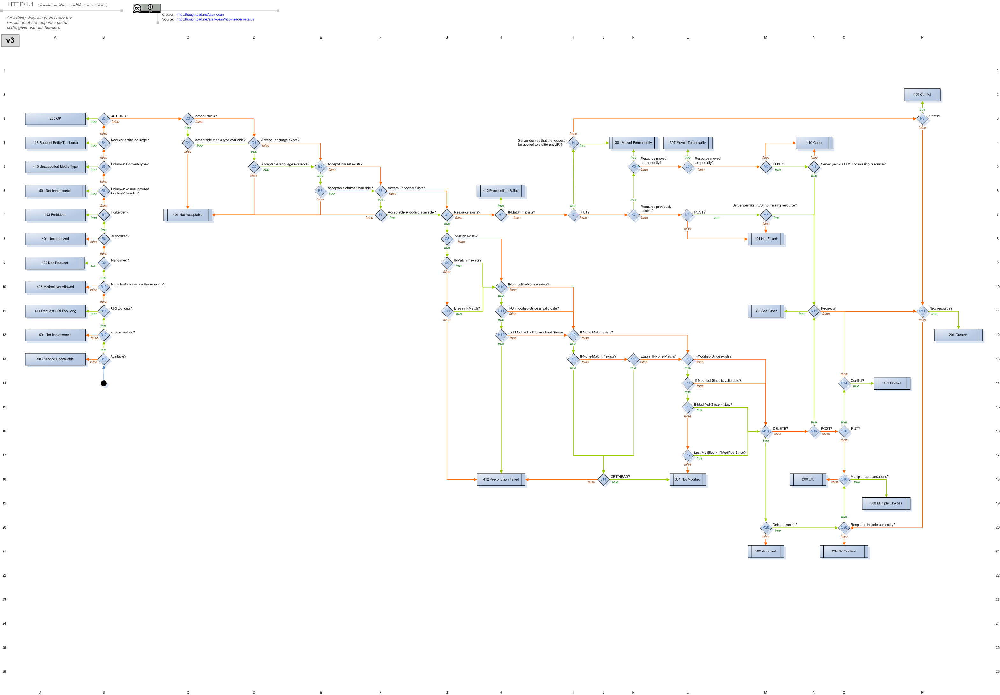

# The HTTP Diagram

ResourceMachine implements the Webmachine v3 HTTP decision diagram. This diagram encodes the full state machine for correct HTTP response generation.

## v3 Diagram

## Reading the Diagram

Each box is a decision point. The label on each arrow is the return value from the corresponding resource method that leads down that branch. Follow the arrows from `v3b13` (top) to any of the terminal status codes (leaves).

When you override a resource method, you are controlling which branch is taken at that node. All other nodes fall through to their defaults.
